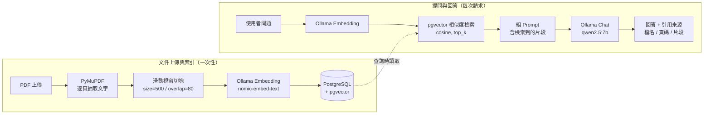

# offline-doc-qa

一個可完全離線運行的本地文件問答系統：上傳 PDF，問問題，得到附頁碼引用的答案。設計目標是機密文件不可外傳至雲端的情境（法務、內部規章、客戶合約等）——整個流程不呼叫任何雲端 API。

## 架構



## Demo 截圖

`docs/screenshot.png`（尚未附上——本次開發環境是無 GUI 的 sandbox，沒有瀏覽器可以截圖。已用 `curl` 完整驗證過 API 行為，見下方「驗證結果」，但畫面本身未經視覺確認，實際部署後請補上這張圖）。

## 快速開始

```bash
cp .env.example .env
ollama pull nomic-embed-text && ollama pull qwen2.5:7b
docker compose up
```

打開 `http://localhost:8000`，左側上傳 PDF，右側提問即可。

> Ollama 需已在 host 上啟動（`ollama serve` 或系統服務）。`docker-compose.yml` 預設用 `host.docker.internal` 連回 host 的 Ollama；Linux 上的原生 Docker Engine 需要 `extra_hosts: host.docker.internal:host-gateway`（已內建在 `docker-compose.yml` 裡）。

## 技術棧

| 層 | 選型 |
|---|---|
| 推論 | Ollama（本機） |
| 後端 | FastAPI |
| 向量庫 | PostgreSQL + pgvector |
| PDF 解析 | PyMuPDF |
| 前端 | 單一 HTML 檔，原生 JS，無框架、無 CDN |
| 部署 | Docker Compose |

## 設計決策

| 決策 | 理由 |
|---|---|
| pgvector 而非 Chroma / FAISS | 大多數企業內部系統已經有 PostgreSQL 維運能量；把向量資料放進同一顆資料庫，可以跟既有的業務資料表 JOIN、套用既有的備份/權限/連線池機制，不用再多維運一個獨立的向量資料庫元件。代價是效能與易用性不如專用向量庫（例如沒有現成的 metadata filtering DSL），但對「單一部門、單機部署」這個場景是合理取捨。 |
| chunk size = 500、overlap = 80 | 500 字元大致對應中文 200～300 字或英文 80～100 字的段落長度，足夠讓 embedding 抓到完整語意單元，又不會長到把多個主題混在同一塊裡稀釋掉檢索精準度。overlap 80（約 16%）是為了避免關鍵句子剛好落在切點兩側，導致兩塊都抓不到完整語意；數字本身沒有理論最優解，是常見經驗值，換資料集時應該用實際問答準確率去調。 |
| 保留頁碼 | 這是企業內部使用的必要條件：使用者（尤其是法務、稽核、主管）看到答案後，一定要能回頭翻到原文第幾頁核對，不能只信任 LLM 的輸出。所以 `chunks` 表把 `page_no` 存成獨立欄位，而不是把頁碼燒進文字內容裡，確保引用永遠可追溯到來源。 |
| 前端不用框架 | 這是作品集專案，面試官會直接 `git clone` 之後跑，目標是降低啟動門檻：不用 `npm install`、不用等建置、沒有版本相依地獄。單一 HTML 檔 + 原生 `fetch` 對這個問答介面的複雜度來說完全夠用，換框架只會增加不必要的維護成本。 |
| 模型選型：`nomic-embed-text` + `qwen2.5:7b` | 兩者都是可以跑在單張消費級 GPU（8～12GB VRAM）上的組合：embedding model 271MB 幾乎不佔資源，7B 對話模型在 Q4 量化下約 4.7GB，兩個一起載入仍有餘裕。換成 13B/14B 以上模型答案品質會更好，但單卡 12GB 環境容易 OOM 或被迫用 CPU offload 拖慢回應；這組選型是「回答品質」與「單機可跑」之間的取捨，兩者都可由 `.env` 的 `EMBED_MODEL` / `CHAT_MODEL` 覆寫。換 embedding model 時要注意 `db/init.sql` 裡 `vector(768)` 的維度要跟著改（`nomic-embed-text` 輸出 768 維）。 |
| psycopg3 connection pool（而非每次請求開新連線） | FastAPI 是常駐服務，用連線池可以避免每個請求都付出 TCP + 認證的開銷；池的生命週期綁在 FastAPI 的 `lifespan`，啟動時建立、關閉時釋放，不用全域變數。 |
| HNSW 索引（而非 IVFFlat） | pgvector 的 HNSW 在資料量不大（作品集規模：幾份到幾十份文件）時，建索引成本可忽略，查詢品質與延遲都優於 IVFFlat；資料量成長到百萬級以上時才需要重新評估索引策略與 list/probe 參數。 |

## 已知限制

- **只支援文字型 PDF**：`extract_pages` 用 PyMuPDF 抽文字層，掃描檔（純圖片、無文字層）會抽出空字串，目前沒有整合 OCR，上傳這類檔案會被 API 擋下（`422`）。
- **單機單使用者**：沒有帳號系統，任何能打到這個服務的人都能看到所有文件與問答結果。不適合直接暴露在對外網路。
- **無權限控制 / 無文件隔離**：所有文件共用同一個向量索引，檢索時不會依使用者或文件分類做過濾；多租戶場景需要額外設計 `documents` 表的 owner 欄位與查詢時的過濾條件。
- **Embedding 呼叫是逐筆序列呼叫**：`embeddings.py` 對 Ollama `/api/embeddings` 一次只送一段文字（Ollama 這支 API 本身不支援 batch），大型 PDF 上傳時索引時間會隨頁數線性增加。
- **檢索是純向量相似度，沒有做混合檢索或 reranker**：對關鍵字/專有名詞查詢（例如條款編號、法條號碼）有時不如純文字比對準確，見「後續可擴充」。
- **Demo 截圖尚未附上（未驗證項目）**：本次開發是在沒有 GUI 瀏覽器的環境完成，`docs/screenshot.png` 只留了位置，畫面本身沒有做過視覺驗收，只驗證過 API 回應內容正確。
- **`docker compose` 的 `db` 服務預設不對外開 5432 埠**：因為開發機上已有其他 PostgreSQL 佔用該埠而移除了對外映射；app 容器透過 docker network 內部連線不受影響，若要用 `psql` 從 host 端連進去除錯，需自行在 `docker-compose.yml` 加回 `ports: ["5432:5432"]`（或改成其他未被佔用的埠）。

## 後續可擴充

- OCR（例如整合 Tesseract 或雲端 OCR 的離線替代方案）支援掃描檔。
- 多使用者權限隔離：文件擁有者、共享範圍、檢索時的 row-level 過濾。
- 混合檢索（BM25 + 向量相似度）：對精確關鍵字/條款編號查詢會比純向量檢索更準。
- Reranker：先用向量檢索撈出較大的候選集合，再用 cross-encoder 重新排序，可以顯著提升 top_k 的相關性。
- Embedding batch 化：如果之後 Ollama 或替代的 embedding server 支援單次多筆輸入，可以把 `embeddings.py` 改成一次送整批文字。

## 開發

```bash
./test.sh
```

`tests/test_ingest.py` 驗證切塊邏輯（長度、overlap、空字串處理、中英混排），`tests/test_rag.py` 用 fake embedding client 與 fake store 驗證檢索結果有正確組進 prompt、來源有正確回傳（不打真的 Ollama）。

## 驗證結果（誠實記錄，非全部都在 CI 裡自動跑）

- `./test.sh`：13 個測試全數通過（`test_ingest.py` 9 個、`test_rag.py` 4 個）。
- `docker compose up` 端到端：手動驗證過。上傳一份公開 PDF（聯合國《世界人權宣言》英文版，`https://www.ohchr.org` 公開下載），提問 `"What does Article 6 of the Universal Declaration of Human Rights say?"`，回答內容正確且引用來源正確指向第 3 頁（原文 Article 6 確實在第 3 頁）。`GET /api/documents`、`DELETE /api/documents/{id}`、`GET /api/health`（回報 `ollama_reachable: true`）與靜態首頁也都手動用 `curl` 驗證過會回傳預期結果。
- 前端畫面本身（瀏覽器實際點擊操作）未經人工視覺驗收，只驗證了它呼叫的 API 行為正確，見上方「已知限制」。
